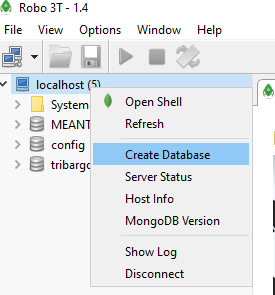
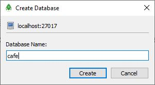
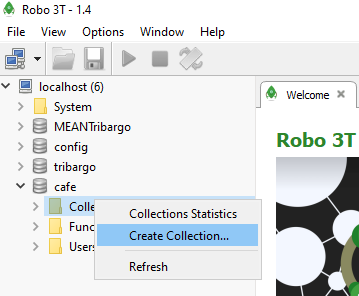
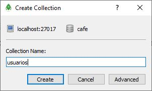
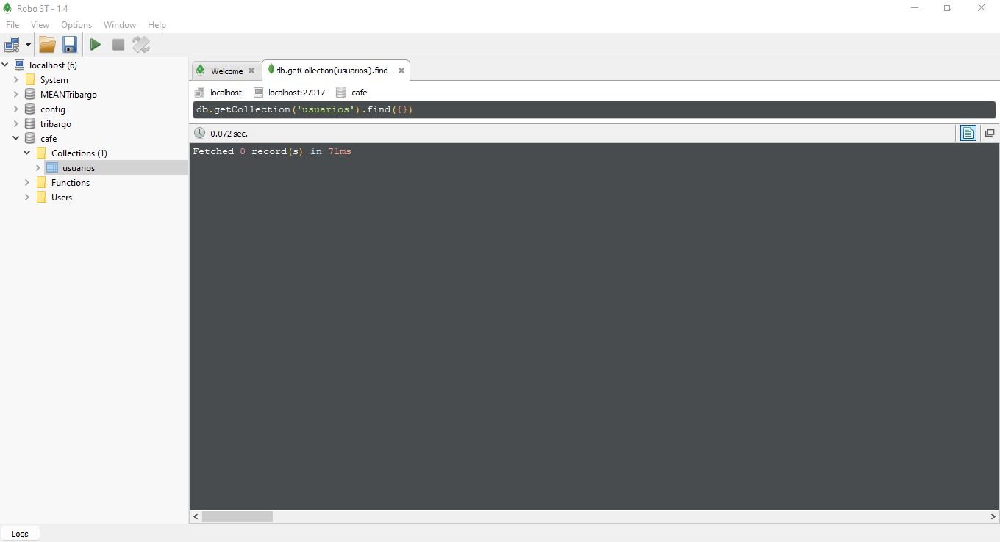
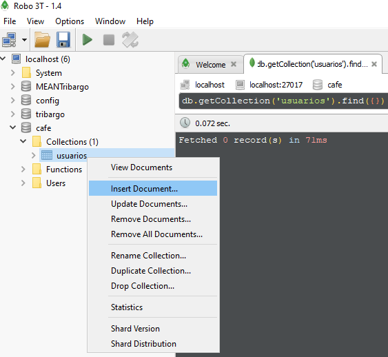
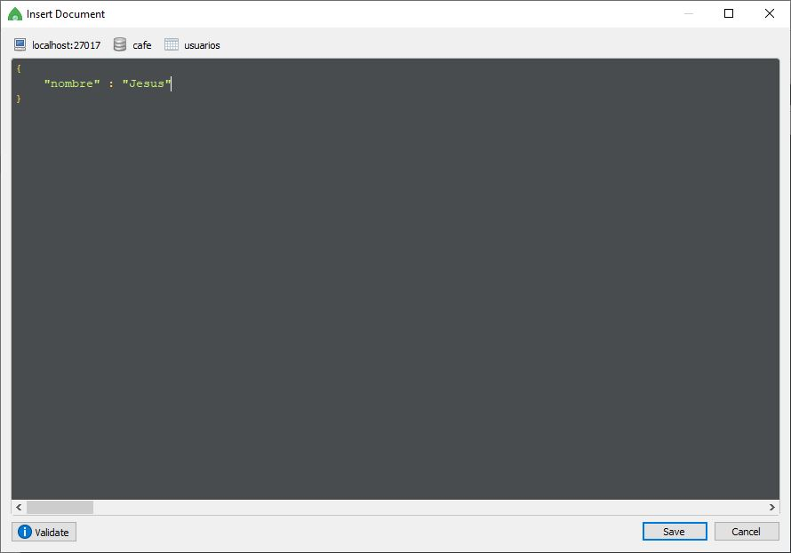
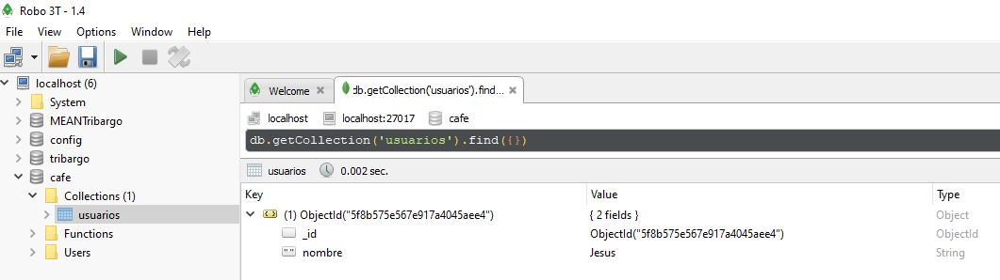
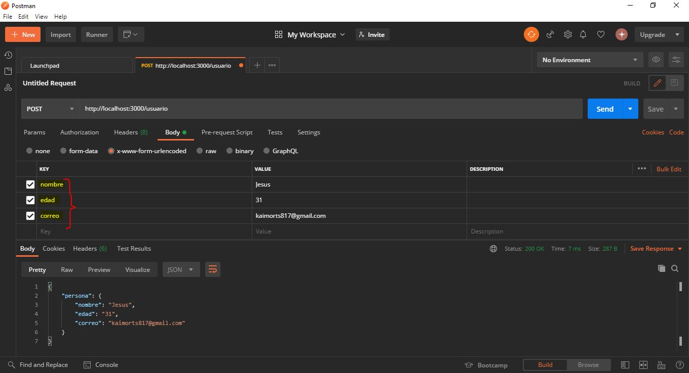
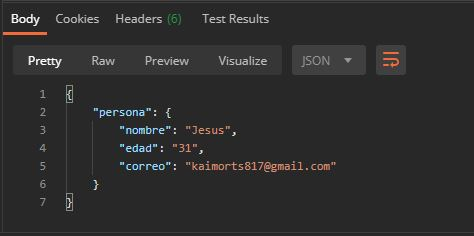

# Usando REST Services con Express

## Requisitos
- Descargar e instalar de forma adecuada MongoDB para el correcto funcionamiento de la aplicación.
- Descargar e instalar [Robot3T](https://robomongo.org/download).
- Poner a correr la base de datos el cuál está contenida en la siguiente ruta: `C:\Program Files\MongoDB\Server\4.0\bin`, y ejecutar `mongod.exe`.
- Abrir __Robot 3T__.

### Robot3T
1. Creamos una conexión.

	

2. Le damos `Connect`.
3. Nos aparecerá una pantalla como la siguiente.

	<center>
		
	</center>

4. Vamos a crear una base de datos de la siguiente manera.

	<center>
		
		
	</center>

5. Le damos doble click en el costado izquierdo donde aparece el nombre de la base de datos creada.

* Seleccionamos __colecciones__.
	> Recuerda que MongoDB es una __base de datos no relacional__.
	>
	> _Las **colecciones** son las tablas de la base de datos_

6. Creamos una __`colección`__, cuyo nombre será __usuarios__.

	<center>
		
		
	</center>

	La pantalla, una vez creada la colección, será la siguiente:

	<center>
		
	</center>

7. En un principio no contendrá ningún registro nuestra base de datos. Así que vamos a crearlo.

	<center>
		
	</center>

	Y ahora, como podemos observar, es un simple `JSON`. Entonces metemos el siguiente campo:

	<center>
		
	</center>

	Le damos __doble click__ a nuestra tabla de usuarios y vemos que ya se ve reflejado el cambio.

	<center>
		
	</center>

	Como podemos ver, tiene dos campos: __nombre__ y __objectId__. Esto es por que MongoDB crea, automáticamente por nosotros, **`_id`** y __*este es único*__.

## REST Server
1. Inicializamos nuestro proyecto.
	> npm init

2. Vamos a trabajar con Express. Entonces vamos a agregarlo de la siguiente forma.

	> npm install express _--save_

3. Vamos a configurar nuestra aplicación tal y como se muestra en la página de Express, [aquí](https://www.npmjs.com/package/express).
	- Creamos una carpeta llamada `server` y dentro de ella creamos un archivo llamado `server.js`.


### Peticiones HTTP
1. GET: Normalmente es usado para mandar información.

	```javascript
	app.get('/usuario', (req, res) => {
		res.json('GET Usuario');
	});
	```

2. POST: Usado para crear nuevos registros o nueva info.

	```javascript
	app.post('/usuario', (req, res) => {
		res.json('POST Usuario');
	});
	```

3. PUT: Es mayormente utilizado para actualizar registros.

	```javascript
	app.put('/usuario', (req, res) => {
		res.json('PUT Usuario');
	});
	```

4. DELETE: Nos ayuda a >>eliminar<< un registro.
	> Normalmente ya no se eliminan registros, sólo se cambia el estado de visualización de los mismos.

	```javascript
	app.delete('/usuario', (req, res) => {
		res.json('DELETE Usuario');
	});
	```

Si a nosotros nos gustaría obtener la información que el usuario mande, lo podemos hacer haciendo uso de `req.body`, de la siguiente forma.

<center>
	
</center>

Para recuperar la información, basta con modificar un poco la función `post`, de la siguiente forma.

```javascript
app.post('/usuario', (req, res) => {
    // Procesar información que le mandamos
    let body = req.body;

    if (body.nombre === undefined) {
        res.status(400).json({
            ok: false,
            mensaje: 'El nombre es necesario'
        });
    } else {
        res.json({
            persona: body
        });
    }
});
```
> _Antes de hacer esto, debes de instalar [body-parser](https://www.npmjs.com/package/body-parser)._

Cuando nosotros mandamos la petición usando el Postman obtenemos la siguiente respuesta.

<center>
	
</center>
