# Usando REST Services con Express

## Requisitos
- Descargar e instalar de forma adecuada MongoDB para el correcto funcionamiento de la aplicación.
- Descargar e instalar [Robot3T](https://robomongo.org/download).
- Poner a correr la base de datos el cuál está contenida en la siguiente ruta: `C:\Program Files\MongoDB\Server\4.0\bin`, y ejecutar `mongod.exe`.
- Abrir __Robot 3T__.
- Instalar mongoose.

### Robot3T
1. Creamos una conexión.

	

2. Le damos `Connect`.
3. Nos aparecerá una pantalla como la siguiente.

	<center>
		
	</center>

4. Vamos a crear una base de datos de la siguiente manera.

	<center>
		
		
	</center>

5. Le damos doble click en el costado izquierdo donde aparece el nombre de la base de datos creada.

* Seleccionamos __colecciones__.
	> Recuerda que MongoDB es una __base de datos no relacional__.
	>
	> _Las **colecciones** son las tablas de la base de datos_

6. Creamos una __`colección`__, cuyo nombre será __usuarios__.

	<center>
		
		
	</center>

	La pantalla, una vez creada la colección, será la siguiente:

	<center>
		
	</center>

7. En un principio no contendrá ningún registro nuestra base de datos. Así que vamos a crearlo.

	<center>
		
	</center>

	Y ahora, como podemos observar, es un simple `JSON`. Entonces metemos el siguiente campo:

	<center>
		
	</center>

	Le damos __doble click__ a nuestra tabla de usuarios y vemos que ya se ve reflejado el cambio.

	<center>
		
	</center>

	Como podemos ver, tiene dos campos: __nombre__ y __objectId__. Esto es por que MongoDB crea, automáticamente por nosotros, **`_id`** y __*este es único*__.

## REST Server
1. Inicializamos nuestro proyecto.
	> npm init

2. Vamos a trabajar con Express. Entonces vamos a agregarlo de la siguiente forma.

	> npm install express _--save_

3. Vamos a configurar nuestra aplicación tal y como se muestra en la página de Express, [aquí](https://www.npmjs.com/package/express).
	- Creamos una carpeta llamada `server` y dentro de ella creamos un archivo llamado `server.js`.


### Peticiones HTTP
1. GET: Normalmente es usado para mandar información.

	```javascript
	app.get('/usuario', (req, res) => {
		res.json('GET Usuario');
	});
	```

2. POST: Usado para crear nuevos registros o nueva info.

	```javascript
	app.post('/usuario', (req, res) => {
		res.json('POST Usuario');
	});
	```

3. PUT: Es mayormente utilizado para actualizar registros.

	```javascript
	app.put('/usuario', (req, res) => {
		res.json('PUT Usuario');
	});
	```

4. DELETE: Nos ayuda a >>eliminar<< un registro.
	> Normalmente ya no se eliminan registros, sólo se cambia el estado de visualización de los mismos.

	```javascript
	app.delete('/usuario', (req, res) => {
		res.json('DELETE Usuario');
	});
	```

Si a nosotros nos gustaría obtener la información que el usuario mande, lo podemos hacer haciendo uso de `req.body`, de la siguiente forma.

<center>
	
</center>

Para recuperar la información, basta con modificar un poco la función `post`, de la siguiente forma.

```javascript
app.post('/usuario', (req, res) => {
    // Procesar información que le mandamos
    let body = req.body;

    if (body.nombre === undefined) {
        res.status(400).json({
            ok: false,
            mensaje: 'El nombre es necesario'
        });
    } else {
        res.json({
            persona: body
        });
    }
});
```
> _Antes de hacer esto, debes de instalar [body-parser](https://www.npmjs.com/package/body-parser)._

Cuando nosotros mandamos la petición usando el Postman obtenemos la siguiente respuesta.

<center>
	
</center>

## Ambientes de desarrollo y producción
Se crea una carpeta `config` la cuál nos permite cambiar de forma más transparente el ambiente: de desarrollo y de producción, sin que modifiquemos código, directamente en nuestra aplicación.

## Crear app en Heroku desde terminal
1. Ir al directorio en donde está tu proyecto
2. Ejecutar los siguientes comandos:

	- > git init
	- > git add .
	- > git commit -m "message"
	- > heroku create
	- > git push heroku master

Nota:
> No olvides de debes de agregar comando __start__ en el `package.json` para que lo ejecute de forma exitosa.
```javascript
"scripts": {
        "start": "node server/server.js",
        "test": "echo \"Error: no test specified\" && exit 1"
    },
```

__Heroku va a poner un nombre que él crea y el que esté disponible__. Para este caso el nombre de la página web valida es [este](https://stark-lowlands-63501.herokuapp.com/).

## Pro Tip
Si nosotros ejecutamos nuestra aplicación y mandamnos una petición GET con el Postman, podemos ver lo siguiente.

IMAGEN DE WEB CON POSTMAN

IMAGEN DE LOCALHOST CON POSTMAN

En ambos casos, lo que se hace es bastante similar, a excepción de que en la URL es: `https://stark-lowlands-63501.herokuapp.com`/usuario y en el otro es `http://localhost:3000`/usuario.

Esto puede llegar a ser un poco tedioso al especificar cuál es de desarrollo y cuál es de producción.

Para poder evitar esto, __hay una forma de configurar los `enviroments` (_ambientes_) utilizando el Postman. 

### Creando un `enviroment` en Postman
1. Abrir postman y ubicar en donde dice `No Enviroment`.

<center>
	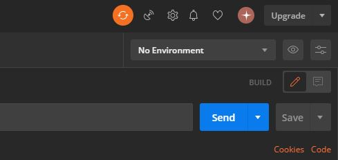
</center>

2. Seleccionar la opción de configuración de `enviroments`.

<center>
	
</center>

3. Agregar un nuevo `enviroment` cuyo nombre será __`Producción`__

<center>
	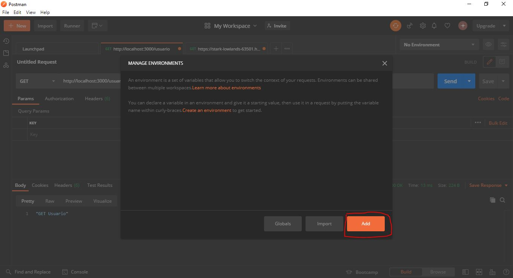
</center>

4. Colocamos la variable `url` y su valores será __la URL asignada por Heroku sin `/usuario`__.

<center>
	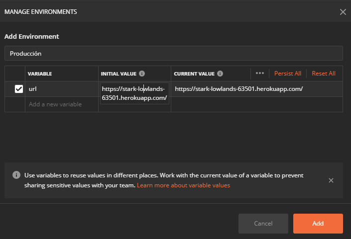
</center>

5. Ahora vamos a hacer lo mismo para desarrollo

<center>
	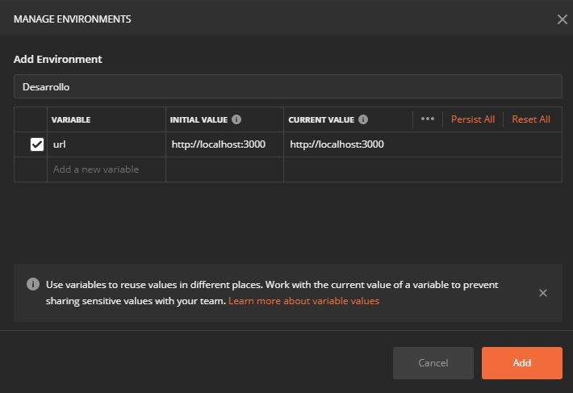
</center>

6. Vamos a cerrar todas las pestañas de las peticiones anteriores. La pantalla que deberías de ver sería algo como la siguiente.

<center>
	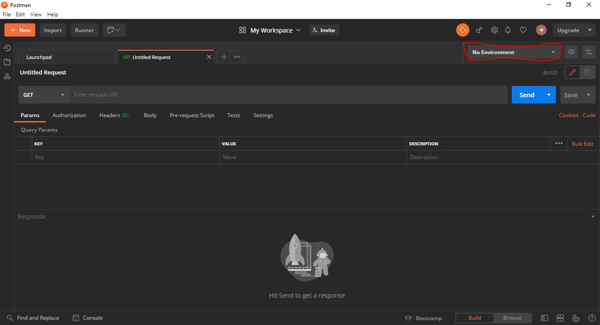
</center>

7. Ahora seleccionamos un ambiente. Por ejemplo, si es el de desarrollo debemos hacer lo siguiente en la petición GET

	> `{{url}}`/usuario

Tal y como se muestra en la imagen

<center>
	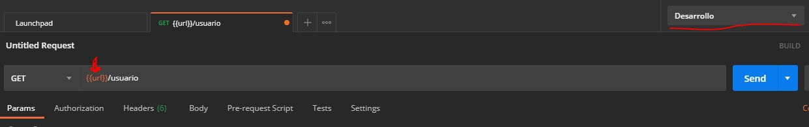
</center>

Y como se puede ver, una vez que se hace la petición, funciona:

<center>
	
</center>

8. Ahora, si cambio ahora solamente el ambiente a Producción, sin alterar la URL, veamos que sigue funcionando.

<center>
	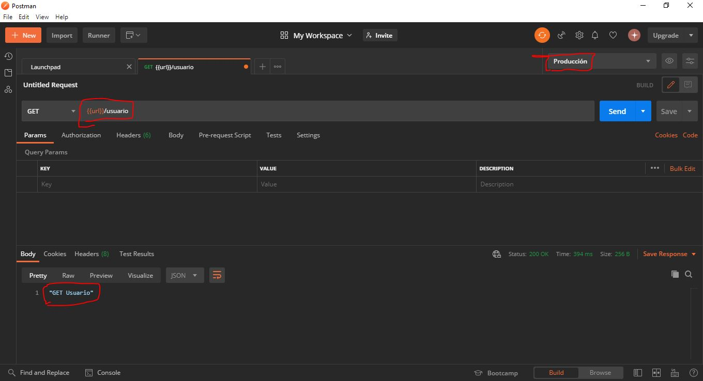
</center>

> ¿Cómo podemos comprobar que realmente funciona?

Bueno, lo que podríamos hacer es alterar un poco el contenido de la función para la petición GET de la siguiente forma y ver si corre.

```javascript
app.get('/usuario', (req, res) => {
    res.json('GET Usuario LOCAL');
});
```

Entonces en local debería aparecernos ese mensaje, pero en producción no. Veamos si es verdad.

- Producción:

<center>
	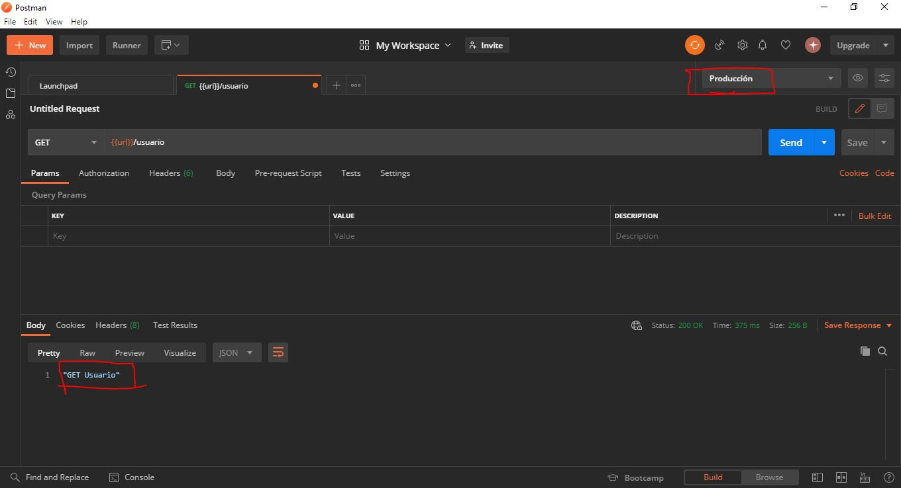
</center>

- Desarrollo

<center>
	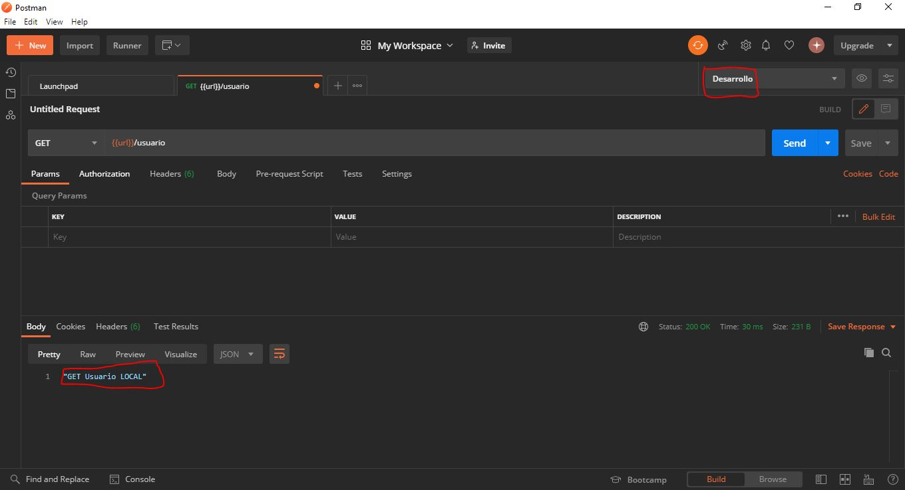
</center>

## Agregando Mongoose
1. Ir a la página de npm y buscar [mongoose]()
2. Instalar el paquete de la siguiente forma:

	> npm install mongoose --save

3. Agregar la conexión a la base de datos.

```javascript
mongoose.connect('mongodb://localhost:27017/cafe', {
    useNewUrlParser: true,
    useUnifiedTopology: true,
    useFindAndModify: false,
    useCreateIndex: true
}, (err, res) => {
    if (err) throw err;
    console.log("BASE DE DATOS ONLINE")
});
```
> Puede que el número del puerto varie, dependiendo al que esté asociado en su máquina.

## Simplificando el `server.js`.
Normalmente el archivo app.js o server.js suele ser muy corto y simple con el fin de que pueda ser entendido por otras personas.
Por esta razón vamos a modular el código.

Para ello vamos a crear una carpeta llamada `routes`, la cuál va a contener las rutas o controladores de la aplicación. Dentro de ella __creamos un archivo llamado `user.js`__, el cuál va a contener todas las funciones de las peticiones HTTP.

## Creando el modelo Usuario
Para poder crear una colección (análogo a una tabla) en la base de datos debemos de crear una carpeta llamada __models__, la cuál contendrá los esquemas que nos permitirán crearlas colecciones.

- Colección `usuario.js`: Contiene los siguientes campos:
	- nombre: `String` - required
	- email: `String` - required
	- password: `String` - required
	- img: `String`
	- rol: `String`
	- estado: `Boolean`
	- google: `Boolean`

> Finalmente exportamos el `schema`, cuyo nombre de la "tabla o colección" va a ser 'Usuario':
>
> `module.exports = mongoose.model('Usuario', usuarioSchema);`

## Agregando registro a la colección `Usuario`
Para poder hacer eso, lo haremos usando la función petición HTTP `POST`, de la siguiente forma:

1. Primero vamos a importar el Schema para poder acceder a la colección y crear nuestro primer registro.

> const Usuario = require('../models/usuario');

2. Ahora vamos obtener los datos que nos pasan.

	```javascript
	let usuario = new Usuario({
	        nombre: body.nombre,
	        email: body.email,
	        password: body.password,
	        rol: body.rol
	    });
	```
	> Recuerda que nombre, email y password son requeridos.

3. Finalmente verificamos si hay algún error, y lo manejamos.

	```javascript
	usuario.save((err, usuarioDB) => {
	        if (err || isNotAllData) {
	            return res.status(400).json({
	                ok: false,
	                err: err
	            });
	        }

	        res.json({
	            ok: true,
	            usuario: usuarioDB
	        });
	    });
	```

4. Usamos el Postman para verificar esto.

<center>
	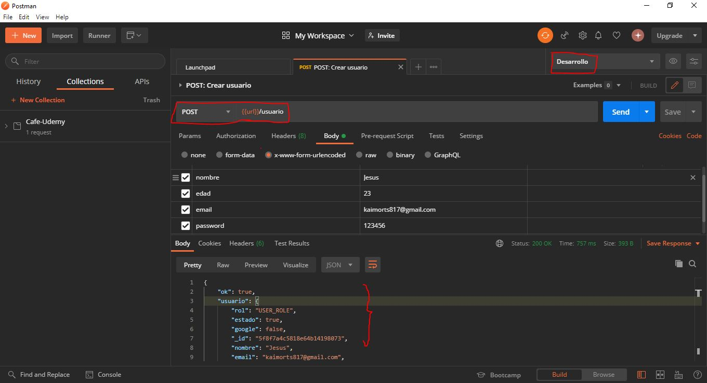
</center>

5. Finalmente guardamos esa petición ya que la estaremos usando más adelante.

<center>
	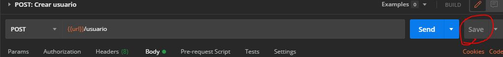
</center>
