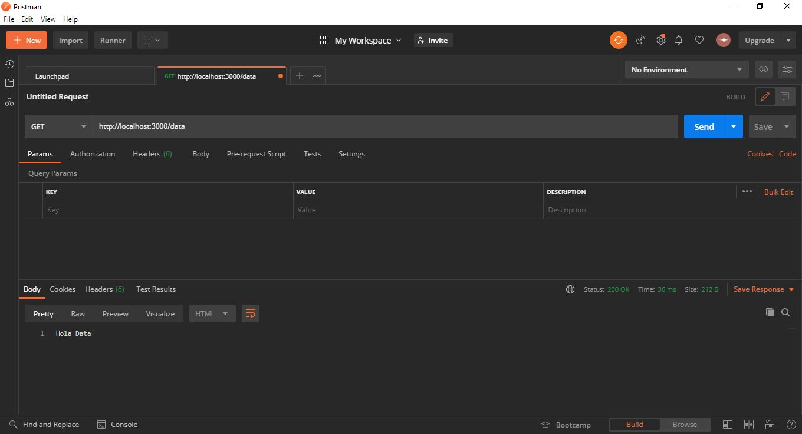
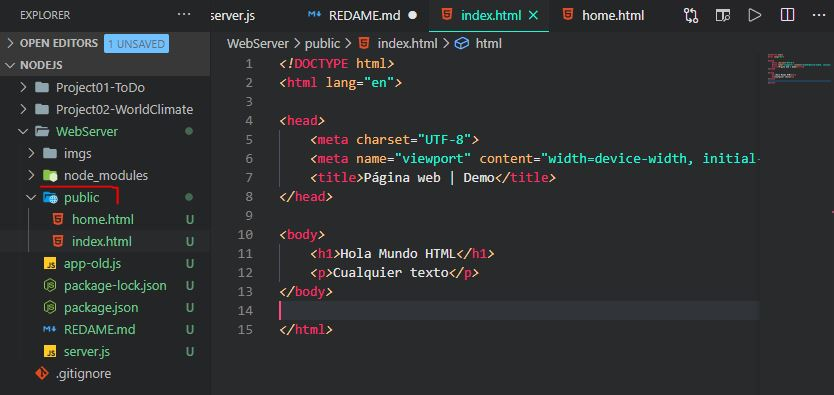
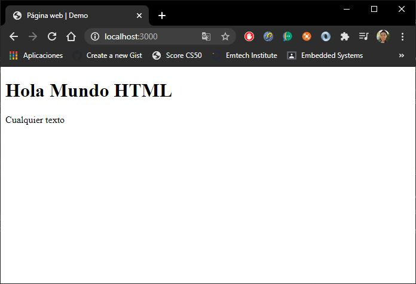
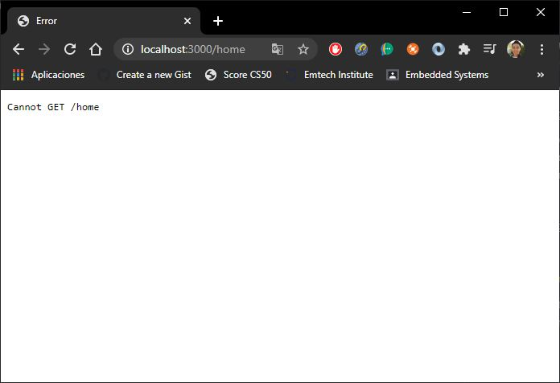
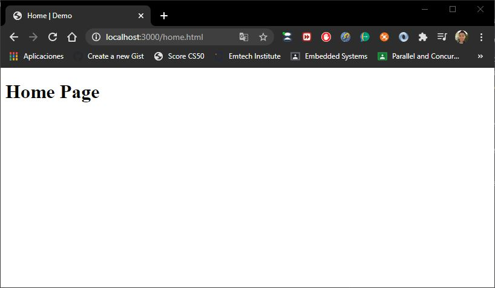

# WebServer

## Introducción a Express
Durante esta sección se ve como podemos crear un servicio web básico haciendo uso de **Express**.

Anteriormente, para poder crear peticiones _HTPP_ se utilizaba el módulo de `HTTP`, y se creaba una petición web de la siguiente manera:


```javascript
// -------- USANDO HTTP --------
const http = require('http');
const PORT = 8080;

http.createServer((req, res) => {
        res.write("Hola Mundo\n");
		res.write(JSON.stringify(salida));
        res.end();
    })
    .listen(PORT);

console.log(`Escuchando el puerto ${PORT}.`);
```
Sin embargo, gracias a la aparición de `Express`, este mismo código puede realizarse en menos líneas, y un más entendible.

```javascript
// -------- USANDO EXPRESS --------
const express = require('express');
const app = express();
const PORT = 3000;

app.get('/', (req, res) => {
    res.send('Hola Mundo');
});

app.listen(PORT, () => {
    console.log(`Escuchando peticiones en el puerto ${PORT}`);
});
```

Quizás no se vea muy poderoso en primera instancia, pero si quisiéramos extender esto para que validara y trabajase con más rutas, __usando http sería muy engorroso__. Sin embargo, cuando trabajamos con __express__ hacemos uso de algo que se llama `middlewares`, los cuáles __nos permiten tener un control de las rutas de nuestra página o proyecto web__. 

> Por ejemplo, si quisiéramos una nueva ruta cuyo nombre sea `localhost:3000/data`, para hacerlo con Express se haría lo siguiente.

```javascript
const express = require('express');
const app = express();
const PORT = 3000;

app.get('/', (req, res) => {
    res.send('Hola Mundo');
});

app.get('/data', (req, res) => {
    res.send("Hola Data");
});

app.listen(PORT, () => {
    console.log(`Escuchando peticiones en el puerto ${PORT}`);
});
```

Si probamos este código en el `Postman` nos da lo siguiente.




## Servidor contenido estático
Para poder ir explicando esta sección lo que se hará es crear una carpeta llamada `public`, dentro de la cuál haremos un archivo `HTML` para desplegar una página web.

> _¿Cómo se hace para que el servidor de **Express** muestre esta página web de nombre `index.html`_
>
> _¿Cómo hago que me muestre la página cuanod haga `localhost:3000/`_



Para poder hacer esto haremos uso de nuestro __middleware__.

> __Middleware__: Es básicamente una instrucción/callback siempre _sin importar que URL es la que la persona pida_.
>
> ¿Cómo creamos ese `middleware`?

Para poder hacer esto lo que haremos será lo siguiente.

```javascript
const express = require('express');
const app = express();
const PORT = 3000;

// Usando el middleware
app.use(express.static(__dirname + '/public'));
...
```

En donde:
* `express.static`: Es la _callback_ que estamos usando.
* `__dirname`: Nos especifica el __directorio actual__.
* `/public`: Es el folder que será estático o público.

Ahora vamos a ver si nuestro código funciona bien.



Normalmente es recomendable comentar nuestro código donde hacemos uso del `app.get` ya que puede entrar en conflicto. Entonces nuestro código quedaría como lo siguiente:

```javascript
const express = require('express');
const app = express();
const PORT = 3000;

// Usando el middleware
app.use(express.static(__dirname + '/public'));

/*
app.get('/', (req, res) => {
    //res.send('Hola Mundo');
});
*/

/*
app.get('/data', (req, res) => {
    res.send("Hola Data");
});
¨*/

app.listen(PORT, () => {
    console.log(`Escuchando peticiones en el puerto ${PORT}`);
});
```

> _Pero, ¿qué pasa si quiero otra URL?_ como `localhost:3000/home`.

Bueno, probemos y veamos que pedo.


Como podemos ver nos muestra un error porque no hemos habilitado esa ruta. Para hacerlo, vamos a crear una página, dentro de `public/` llamado __home.html__. 



Sin embargo, vemos que no regresa nada __ya que lo que busca es un `servicio` no una página. Es decir, un folder que se llame `home` y que dentro tenga un archivo llamado `index.html`. 

> Para este caso __debemos especificar el nombre del archivo al que desamos acceder. En este caso `home.html`



## Crear una pequeña página web

Lo primero que vamos a hacer es ir a la página de [Bootstrap](https://getbootstrap.com/docs/4.5/getting-started/download/) y le daremos en `Download source`. Todo esto con el fin de meterle estilo a nuestra página.


En este punto ya tenemos nuestra página completa.
Sin embargo, _¿qué pasaría si queremos agregar una página más?_. Probablemente sería esto
* Tendriamos que copiar todo el código de la página: encabezados, footers, navbars, etc.
* Adaptar la página y más.

Afortunadamente _Express_ trabaja con librerías y paquetes que permite la renderización dinámica de sitios web.

Para ello trabajaremos con __handlebars__.

### Handlebars (hbs)
Este paquete (hbs) le permitirá a __Express__ renderizar las páginar con el fin de mandarle una respuesta a nuestro cliente para hacer algo como:

```javascript
<p> {{firstname}} {{lastname}} </p>
```

> _TODO ESTO CON EL FIN DE HACERLO DINÁMICO_
En primera instancia se deberá de instalar

> >npm install hbs --save